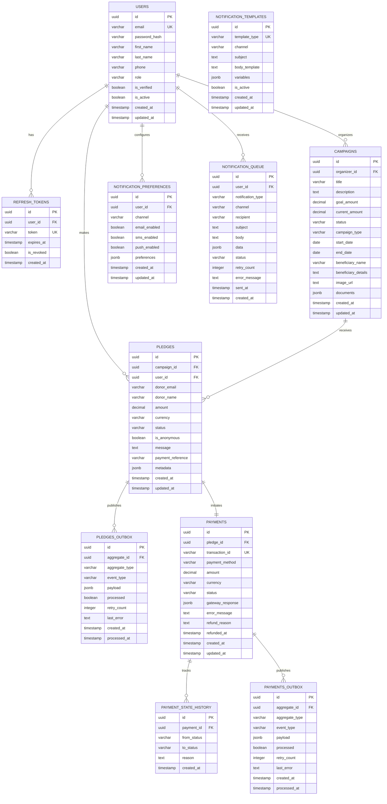

# CareForAll - Database Schema

## Architecture Overview

The CareForAll platform uses a **microservices architecture** with **schema-per-service** pattern. Each microservice has its own database schema for data isolation and service independence.

## Database Schemas

### 1. Auth Schema (Authentication Service)
Manages user authentication, authorization, and profile information.

### 2. Campaigns Schema (Campaign Service)
Handles fundraising campaigns and beneficiary information.

### 3. Pledges Schema (Pledge Service)
Manages donation pledges with Transactional Outbox pattern for event-driven architecture.

### 4. Payments Schema (Payment Service)
Handles payment processing, gateway integration (SSL Commerz), and transaction history.

### 5. Notifications Schema (Notification Service)
Manages notification templates, user preferences, and delivery tracking.

---

## Entity Relationship Diagram



---

## Schema Details

### Auth Schema (auth.*)

**Tables:**
- `auth.users` - User accounts and profiles
- `auth.refresh_tokens` - JWT refresh token management

**Key Features:**
- Role-based access control (USER, ORGANIZER, ADMIN)
- Email verification system
- Secure password hashing (bcrypt)
- Refresh token rotation

---

### Campaigns Schema (campaigns.*)

**Tables:**
- `campaigns.campaigns` - Fundraising campaigns

**Key Features:**
- Campaign types: MEDICAL, EDUCATION, DISASTER_RELIEF, GENERAL
- Status workflow: DRAFT → ACTIVE → PAUSED → COMPLETED → CANCELLED
- Full-text search on title and description
- Document storage (JSONB) for supporting files
- Goal tracking with current_amount updates

**Indexes:**
- `idx_campaigns_status` - Filter by status
- `idx_campaigns_organizer` - Organizer's campaigns
- `idx_campaigns_type` - Filter by campaign type
- `idx_campaigns_search` - Full-text search (GIN index)

---

### Pledges Schema (pledges.*)

**Tables:**
- `pledges.pledges` - Donation pledges (supports anonymous donors)
- `pledges.outbox` - Event outbox for Transactional Outbox pattern

**Key Features:**
- Anonymous donation support (nullable user_id)
- Pledge status: PENDING → PAYMENT_INITIATED → COMPLETED/FAILED/CANCELLED
- Event-driven architecture with outbox pattern
- Donor email tracking for anonymous donors

**Indexes:**
- `idx_pledges_campaign` - Campaign pledges
- `idx_pledges_user` - User's pledges
- `idx_pledges_status` - Status filtering
- `idx_outbox_processed` - Unprocessed events

---

### Payments Schema (payments.*)

**Tables:**
- `payments.payments` - Payment transactions
- `payments.payment_state_history` - State transition audit log
- `payments.outbox` - Payment events for downstream services

**Key Features:**
- SSL Commerz gateway integration
- Payment state machine with validation
- State transitions: PENDING → AUTHORIZED → CAPTURED → COMPLETED
- Refund support with reason tracking
- Idempotent payment processing

**Indexes:**
- `idx_payments_pledge` - Pledge payments
- `idx_payments_transaction` - Transaction ID lookup
- `idx_payments_status` - Status filtering
- `idx_payment_history` - Audit trail

---

### Notifications Schema (notifications.*)

**Tables:**
- `notifications.notification_templates` - Reusable message templates
- `notifications.notification_preferences` - User notification settings
- `notifications.notification_queue` - Pending/sent notifications

**Key Features:**
- Multi-channel support (EMAIL, SMS, PUSH)
- Template variables for personalization
- Retry mechanism with exponential backoff
- User preference management
- Notification status tracking

**Indexes:**
- `idx_notifications_user` - User notifications
- `idx_notifications_status` - Pending notifications
- `idx_notifications_type` - Filter by type

---

## Event-Driven Architecture

### Transactional Outbox Pattern

Both **Pledges** and **Payments** services use the Transactional Outbox pattern to guarantee event publishing:

1. **Write to Database + Outbox (Atomic Transaction)**
   - Business entity (pledge/payment) is created/updated
   - Event is written to outbox table
   - Both operations succeed or fail together

2. **Outbox Processor (Background Job)**
   - Polls outbox table for unprocessed events
   - Publishes events to Redis message queue
   - Marks events as processed
   - Implements retry logic with exponential backoff

3. **Event Consumers**
   - Campaign Service: Updates campaign amounts
   - Notification Service: Sends confirmation emails
   - Admin Service: Real-time dashboard updates

### Published Events

**Pledge Events:**
- `PLEDGE_CREATED` - New pledge created
- `PLEDGE_PAYMENT_INITIATED` - Payment process started
- `PLEDGE_COMPLETED` - Payment successful
- `PLEDGE_FAILED` - Payment failed
- `PLEDGE_CANCELLED` - User cancelled pledge

**Payment Events:**
- `PAYMENT_AUTHORIZED` - Payment authorized by gateway
- `PAYMENT_CAPTURED` - Funds captured
- `PAYMENT_COMPLETED` - Payment finalized
- `PAYMENT_FAILED` - Payment processing failed
- `PAYMENT_REFUNDED` - Refund processed

---

## Data Consistency Patterns

### Campaign Amount Updates

Campaign `current_amount` is updated through event-driven architecture:

```
Pledge Created (pending) → No amount update
Payment Completed → Increment campaign.current_amount
Payment Refunded → Decrement campaign.current_amount
```

### Payment State Machine

```
pending → authorized → captured → completed
                               ↓
                           refunded
        ↓
     failed
```

All state transitions are validated and logged in `payment_state_history`.

---

## Security Features

1. **Row-Level Security Considerations**
   - Pledges: Users can only view their own pledges (unless admin)
   - Campaigns: Organizers can only modify their own campaigns
   - Payments: Linked to pledges for authorization

2. **Data Privacy**
   - Anonymous donations (donor_name shown as "Anonymous")
   - Email masking for anonymous donors in public views
   - Payment details restricted to pledge owners

3. **Audit Trail**
   - Payment state history tracks all transitions
   - Created/updated timestamps on all tables
   - Event outbox preserves all state changes

---

## Performance Optimizations

1. **Indexes**
   - Composite indexes for common query patterns
   - GIN index for full-text search on campaigns
   - Indexes on foreign keys and status fields

2. **Partitioning Strategies** (Future)
   - Pledge partitioning by created_at (monthly/yearly)
   - Payment history partitioning by timestamp
   - Notification queue partitioning by status

3. **Caching Strategy**
   - Campaign data cached in Redis (5-minute TTL)
   - User profiles cached after authentication
   - Notification templates cached on service startup

---

## Database Connection Info

**For DBeaver Connection:**
- **Host:** localhost
- **Port:** 5432
- **Database:** careforall
- **User:** postgres
- **Password:** postgres

**Docker Connection:**
```bash
docker exec -it careforall-postgres psql -U postgres -d careforall
```

---

## Quick Stats Query

```sql
-- Platform Statistics
SELECT
    (SELECT COUNT(*) FROM auth.users) as total_users,
    (SELECT COUNT(*) FROM campaigns.campaigns WHERE status = 'active') as active_campaigns,
    (SELECT COUNT(*) FROM pledges.pledges WHERE status = 'completed') as completed_pledges,
    (SELECT SUM(amount) FROM payments.payments WHERE status = 'completed') as total_raised;
```

---

Generated for CareForAll Demo - Database Schema Documentation
